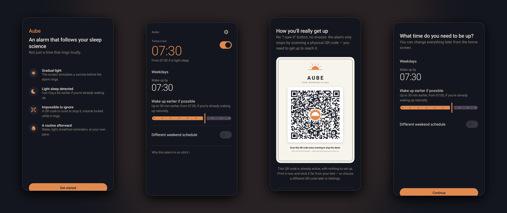

# Aube: Science-Based Smart Alarm Clock for Android

[](LICENSE)
[](https://developer.android.com)
[](https://kotlinlang.org)
[](#languages)

<p align="center">
  
</p>

**Aube** is a free, open-source, science-based smart alarm clock for Android. No snooze button, a consistent wake time, gradual sunrise (dawn) simulation, light-sleep-aware wake timing, and a physical QR-code dismiss step. Each choice is backed by sleep research, not just UX taste.

> ⚠️ Wellness tool, not a medical device. Not intended to diagnose, treat, or prevent any sleep disorder.

> 📱 **Meant for a spare phone you no longer use.** Aube's strict mode ("hardcore mode") turns the phone into a single-purpose alarm: it takes over the device as *device owner*, removes the lock screen, blocks the power menu while ringing, and refuses to be force-stopped or uninstalled. That is exactly what you want from an alarm you can't talk yourself out of, and exactly what you don't want on your daily phone. Use an old Android phone, plug it in on the nightstand, and let it do one job. See [Hardcore mode](#hardcore-mode-device-owner).

## Features

- 🌅 Dawn simulation: screen ramps from black to full brightness before the alarm sounds
- 🔊 Volume ramp synced to the same window, instead of full blast on trigger
- 🚫 No snooze button, anywhere, ever
- 🔒 Sleep-duration lock: set how much sleep you want during onboarding, and the alarm switch/wake time can't be touched once you're inside that window before the deadline
- 📆 One consistent wake-by time per day (optional separate weekday/weekend)
- 🛌 Accelerometer-based light-sleep detection: can wake you up to 45 min early if you're already stirring
- 📱 QR/barcode dismiss: scan a code placed somewhere you have to get out of bed to reach
- 🔐 Hard to bypass: screen pinning, full-screen overlay, volume-key lock, foreground service independent of the UI, boot-resume
- 🧱 Hardcore mode (device owner, spare phone): power menu disabled while ringing *and* all night (a pinned black "night screen" from bedtime until the alarm), no Home/Recents/status bar, force-stop/clear-data/uninstall/safe-mode/factory-reset refused by the OS, ring resumes ~40 s after a forced hardware reboot with no mute
- 🔋 Charge guard: if the phone is unplugged below 40%, or still unplugged (and at or below 50%) at the evening reminder time you pick during onboarding, it chirps until someone plugs it in, more sparsely as the battery gets lower; never a sound during the sleep window itself
- 🆘 Emergency fallback: long randomized-string challenge if you don't have the code, restarts from scratch on the first wrong character
- ⏰ Bounded auto-stop: 1h ring, then pulses for a few hours, then gives up instead of running forever
- ☀️ Optional post-wake reminders (water, light, breakfast)
- 🌍 10 languages, follows system locale
- 🆓 Free, open source, no ads, no tracking, no account

## The Science

| Design choice | Why |
|---|---|
| **No snooze** | Repeated fragmented awakenings extend sleep inertia (grogginess/impaired cognition after waking). [PMC study](https://www.ncbi.nlm.nih.gov/pmc/articles/PMC9804954/) · [Sleep Doctor](https://sleepdoctor.com/pages/health/sleep-inertia) |
| **Same wake time daily** | Sleep regularity correlates with better mental/physical/cognitive health outcomes, often more than total duration. [Systematic review](https://www.sciencedirect.com/science/article/abs/pii/S108707922500156X) · [Review](https://cdnsciencepub.com/doi/10.1139/apnm-2020-0032) · [PMC study](https://www.ncbi.nlm.nih.gov/pmc/articles/PMC5468315/) |
| **Dawn simulation** | Gradual light exposure before wake time signals reduced melatonin, easing the transition; shown to reduce time-to-wakefulness vs. an abrupt alarm. [Wikipedia](https://en.wikipedia.org/wiki/Dawn_simulation) · [Sleep Review](https://sleepreviewmag.com/sleep-treatments/therapy-devices/light-therapy/light-dawn-simulation/) · [Study](https://www.researchgate.net/publication/260130874_Effects_of_dawn_simulation_on_markers_of_sleep_inertia_and_post-waking_performance_in_humans) |
| **Light-sleep wake window** | Waking from deep/slow-wave sleep produces more grogginess than waking from light sleep. Same principle behind wearable "smart alarms." |
| **QR code, not a button** | A groggy brain can dismiss a notification on autopilot; getting up and scanning a code forces real motor planning. Behavioral reasoning, not a specific study. |
| **Sleep-duration lock** | The alarm's own settings are as bypassable as anything else at 3am, half-asleep. Locking edits during the sleep window you set removes that decision entirely, a commitment-device pattern rather than a specific sleep study. |

Snooze research is genuinely mixed: some studies find it near-neutral. Aube's position is to remove the trade-off, not relitigate it every morning.

### What software can and can't block

Powering the phone off defeats every on-device protection at once: no code runs while a device is off. A regular app can't block the power menu (Android reserves it to the OS); [hardcore mode](#hardcore-mode-device-owner) can. What no software on any phone can block is the hardware forced reboot (power held ~10 s, handled by the power-management chip before the OS is involved) and a battery running flat. Aube's answer is to make both pointless rather than pretend to prevent them: a ring interrupted by a reboot resumes about 40 s after the cut, at full volume, with the one-time mute already spent, and the charge guard chirps until the phone is back on its charger.

## How It Works

Kotlin + Jetpack Compose, no backend, everything on-device.

- **Scheduling**: `AlarmManager` exact alarms (tracking start + hard safety-net ring)
- **Sleep tracking**: foreground `Service`, accelerometer, movement scoring
- **Ringing**: separate foreground `Service` owns sound/vibration, independent of the UI activity
- **Hardening**: screen pinning, `SYSTEM_ALERT_WINDOW` overlay, volume-key interception, volume watchdog, boot-resume receiver (`LOCKED_BOOT_COMPLETED`, sound restarts from the service before any screen)
- **Hardcore mode**: `DevicePolicyManager` as device owner: lock task with `LOCK_TASK_FEATURE_NONE`, user restrictions (`DISALLOW_APPS_CONTROL`, `DISALLOW_SAFE_BOOT`, `DISALLOW_FACTORY_RESET`, `DISALLOW_CONFIG_DATE_TIME`, …), uninstall blocked, keyguard disabled, stay-awake while plugged
- **Charge guard**: self-rearming `AlarmManager` poll (5 min idle, `setAlarmClock` cadence once nagging, nothing at all between bedtime and the wake window), short foreground service for each chirp on the alarm stream
- **Crash-proof state**: the "ring in progress" flag lives in fsync'd, device-protected `SharedPreferences`; DataStore files corrupted by a power cut are replaced instead of crashing the app
- **QR/barcode**: [ZXing](https://github.com/zxing/zxing) + CameraX, auto-torch for dark rooms
- **Storage**: Jetpack DataStore, local only

## Getting Started

```bash
git clone https://github.com/unchained-42/aube-alarm-clock.git
cd aube-alarm-clock
./gradlew assembleDebug
adb install -r app/build/outputs/apk/debug/app-debug.apk
```

Requires Android 8.0 (API 26)+.

## Hardcore mode (device owner)

Without it, Aube is already hard to dismiss without the QR code, but the power menu still works: long-press power, tap *Power off*, alarm over. Android only lets one kind of app disable that menu, a **device owner** in lock task mode, and only lets an app become device owner on a phone with no accounts and no other users, over adb. That is a one-time setup, and the reason this mode is for a spare phone.

What it does while the alarm rings: hides the power menu (long-press does nothing), pins the alarm screen (no Home, Recents, status bar or lock screen, and the unpin gesture is disabled), and keeps the clock on network time. From bedtime (wake deadline minus your target sleep) until the alarm takes over, a black night screen with a dim clock is pinned the same way, so the phone can't be powered off during the night either — the display still sleeps normally. Permanently: force stop, clear data, uninstall, disable, safe mode and factory reset from Settings are all refused by the OS (also via adb), the lock screen is removed so the alarm can resume within seconds of a reboot, and the screen stays on while plugged in.

What it can't do: block the hardware forced reboot (power held ~10 s) or a dead battery. Both are handled by making them pointless: the ring resumes about 40 s after the cut, at full volume, with the one-time mute already spent, and the charge guard nags until the phone is charging. A spare phone usually has no SIM either, which is why Aube has no "text someone" fallback: everything it does happens on the device.

### Steps

1. **Pick a phone you don't use**, install Aube on it and finish the onboarding.
2. **Remove every account** on the phone: Settings › Accounts (Google, Xiaomi/Samsung/Huawei account, …). Sign out completely; Android refuses `set-device-owner` while any account exists.
3. **Remove secondary users/spaces** (Xiaomi "Second space", Samsung "Secure Folder", work profiles, guest users): Settings › Users, or over adb:
   ```bash
   adb shell pm list users
   adb shell pm remove-user <id>   # every id except 0
   ```
4. **Remove the lock-screen PIN/pattern** (Settings › Security › Screen lock › None). Not strictly required for enrollment, but without it Android runs nothing after a reboot until you unlock, so the alarm couldn't resume on its own.
5. **Enable USB debugging** (Settings › About phone › tap *Build number* 7× › Developer options › USB debugging) and plug the phone into a computer with [adb](https://developer.android.com/tools/releases/platform-tools).
6. **Enroll:**
   ```bash
   adb shell dpm set-device-owner com.reveil.aube/.kiosk.AubeDeviceAdminReceiver
   ```
   Expected: `Success: Device owner set to package com.reveil.aube`. If it complains about accounts or users, go back to steps 2–3.
7. Open Aube › Settings › **Hardcore mode**: it should read *Active*. The policies are applied immediately and re-applied on every app start.
8. **Enable the OEM's autostart / background permissions** for Aube (Settings › Permissions in the app points to the right screen). Device owner doesn't bypass MIUI/EMUI/ColorOS autostart lists, and the boot-resume depends on it.
9. Leave the phone **plugged in** on the nightstand and print the QR code somewhere you have to get out of bed to reach.

To turn it off later: Aube › Settings › Hardcore mode › *Turn hardcore mode off* (refused while an alarm is ringing, which is the point). Once off, the phone behaves like any other; the only other way out is a factory reset from recovery.

Notes for developers: while the alarm is pinned in lock task, `adb install` may fail on OEMs that show an install-confirmation dialog (it can't appear over the pinned screen), and `am force-stop` / `pm clear` are refused for the device-owner package. Debug builds expose `adb shell am broadcast -a com.reveil.aube.debug.FIRE|STOP|GUARD|NIGHT|CONFIG -n com.reveil.aube/.debug.DebugFireReceiver` to start a ring, end one cleanly, force a charge-guard check, put the night screen up, or write a schedule (`--ei latest 600 --ei earliest 570 --ei sleep 480 --ez weekend false --ei reminder 1320`).

## Permissions

| Permission | Why |
|---|---|
| Exact alarms | Fires at the exact minute set |
| Notifications | Ringing + reminder notifications |
| Ignore battery optimizations | Prevents Android killing the tracking/ringing service overnight |
| Full-screen intent | Shows over the lock screen |
| Display over other apps | Powers the "still ringing" overlay |
| Camera | Scans the dismiss code |
| Accelerometer | Light-sleep detection, on-device only, never transmitted |
| Device admin (hardcore mode) | Optional, enrolled over adb: lock task, user restrictions, uninstall block, keyguard off. See [Hardcore mode](#hardcore-mode-device-owner) |

## Languages

French · English · German · Spanish · Chinese (Simplified) · Portuguese · Russian · Japanese · Arabic · Hindi

## Contributing

Issues and PRs welcome. UX/strictness changes should come with reasoning, ideally a source.

## License

MIT, see [LICENSE](LICENSE).

---

<sub>Aube means "dawn" in French.</sub>
